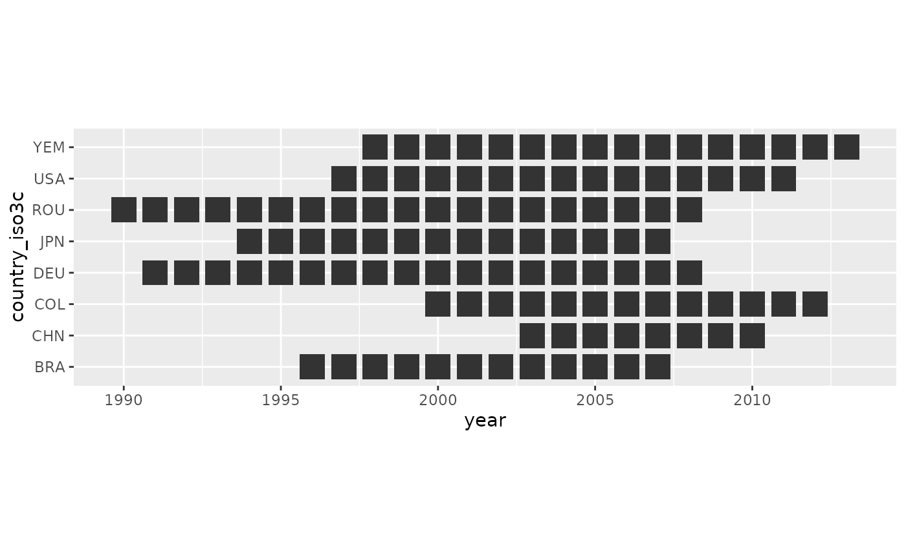

# Extracting Crossmaps from Existing Scripts

``` r

library(xmap)
library(dplyr)
```

## Motivation

Many existing data harmonisation pipelines encode a crossmap’s mapping
logic implicitly, buried inside a legacy data-preparation script rather
than represented as an explicit, checkable table. This kind of script is
hard to audit: the mapping logic is scattered across many conditional
statements, and there is no single artefact that documents which source
codes map to which target category. This vignette walks through
**extracting** the mapping logic implied by such a script into an
explicit, validated `xmap_tbl`, without needing to touch the original
(possibly sensitive) data at all.

## Case 1: Recoding & Aggregation

### The opaque recoding script

Imagine you are given an existing project with a data harmonisation
script:

``` stata
use "C:\Users\Folder\input.dta", clear

gen farmer=0
replace farmer=1 if occupn>6000 & occupn<7000
gen teacher=0
replace teacher=1 if occupn>2400 & occupn<2500
gen professional=0
replace professional=1 if occupn>2000 & occupn<3000 & teacher==0
gen manager=0
replace manager=1 if occupn>1000 & occupn<1129
replace manager=1 if occupn>1131 & occupn<2000
gen armforces=0
replace armforces=1 if occupn<200
gen xefe=0
replace xefe=1 if occupn==1130
gen assprofclerk=0
replace assprofclerk=1 if occupn>3000 & occupn<5000
gen svcsales=0
replace svcsales=1 if occupn>5000 & occupn<6000
replace svcsales=1 if occupn>9000 & occupn<9200
gen labourer=0
replace labourer=1 if occupn>9200 & occupn<9320
gen driver=0
replace driver=1 if occupn>8320 & occupn<8330
replace driver=1 if occupn>9330 & occupn<9340
gen craftrademach=0
replace craftrademach=1 if occupn>7000 & occupn<9000 & driver==0
gen notclass=0
replace notclass=1 if occupn>9990 & occupn<10000
```

You have access to the input data. Note the harmonisation index variable
`occupn`:

``` r

xmap::timor_occupn
#> # A tibble: 11,775 × 5
#>    houseid   pno p3p3_sex  p3p4_age occupn
#>      <dbl> <dbl> <chr>        <dbl>  <dbl>
#>  1 6.02e22     4 1. Male         20    110
#>  2 3.02e22     1 1. Male         40    110
#>  3 6.03e22     1 1. Male         40    110
#>  4 6.02e22     2 2. Female       24    110
#>  5 8.02e22     4 1. Male         28    110
#>  6 6.03e22     1 1. Male         35    110
#>  7 1.01e23     5 2. Female       23    110
#>  8 1.01e22     9 1. Male         28    120
#>  9 4.02e22     1 1. Male         39    140
#> 10 7.05e22     1 1. Male         62    140
#> # ℹ 11,765 more rows
```

You are unable to run the original STATA script, but would like to
reproduce the harmonised data in R, and examine the applied mappings.
You are interested in knowing:

- if any `occupn` codes in the `timor_occupn` data were missed in the
  harmonisation process, leading to silent loss of observations
- how many and which original `occupn` codes were mapped to each
  replacement occupation (e.g. `farmer`, `teacher`, etc.)

These questions are not possible to answer from the input and output
data alone, and it should be clear that parsing the script itself is
quite difficult.

### Recovering the mapping via carbon-paper substitution

The crossmaps framework offers a clear approach for extracting
harmonisation logic from scripts. The basic idea is to pass “simplified
data” through the script, and identify the mapping relationships based
on the output. The simplified data can be thought of as ‘carbon paper’.
To demonstrate this extraction process in this vignette, we first
rewrite the logic from the STATA script in R (using a LLM):

``` r

recode_occupn <- function(occupn) {
  df <- tibble::tibble(occupn = occupn)

  df$farmer <- 0L
  df$farmer[df$occupn > 6000 & df$occupn < 7000] <- 1L

  df$teacher <- 0L
  df$teacher[df$occupn > 2400 & df$occupn < 2500] <- 1L

  df$professional <- 0L
  df$professional[df$occupn > 2000 & df$occupn < 3000 & df$teacher == 0] <- 1L

  df$manager <- 0L
  df$manager[df$occupn > 1000 & df$occupn < 1129] <- 1L
  df$manager[df$occupn > 1131 & df$occupn < 2000] <- 1L

  df$armforces <- 0L
  df$armforces[df$occupn < 200] <- 1L

  df$xefe <- 0L
  df$xefe[df$occupn == 1130] <- 1L

  df$assprofclerk <- 0L
  df$assprofclerk[df$occupn > 3000 & df$occupn < 5000] <- 1L

  df$svcsales <- 0L
  df$svcsales[df$occupn > 5000 & df$occupn < 6000] <- 1L
  df$svcsales[df$occupn > 9000 & df$occupn < 9200] <- 1L

  df$labourer <- 0L
  df$labourer[df$occupn > 9200 & df$occupn < 9320] <- 1L

  df$driver <- 0L
  df$driver[df$occupn > 8320 & df$occupn < 8330] <- 1L
  df$driver[df$occupn > 9330 & df$occupn < 9340] <- 1L

  df$craftrademach <- 0L
  df$craftrademach[df$occupn > 7000 & df$occupn < 9000 & df$driver == 0] <- 1L

  df$notclass <- 0L
  df$notclass[df$occupn > 9990 & df$occupn < 10000] <- 1L

  df
}
```

To form the ‘simplified data’ we extract the unique `occupn` codes from
the `timor_occupn` data:

``` r

(src_occupn <- unique(timor_occupn$occupn))
#>   [1]  110  120  140  190 1110 1120 1130 1141 1142 1143 1210 1223 1224 1225 1226
#>  [16] 1227 1231 1233 1239 1311 1314 1316 1317 2122 2131 2142 2143 2144 2145 2147
#>  [31] 2221 2229 2231 2232 2316 2410 2421 2422 2431 2432 2440 2469 2511 2611 2612
#>  [46] 2619 2922 2924 2933 2939 3112 3113 3114 3115 3119 3132 3151 3152 3212 3221
#>  [61] 3222 3231 3232 3511 3513 3519 3911 3914 3919 3922 3924 3930 3952 4111 4115
#>  [76] 4121 4122 4131 4190 4211 4212 4222 5112 5113 5121 5122 5123 5131 5132 5133
#>  [91] 5134 5141 5149 5161 5162 5163 5169 5220 5230 6111 6112 6113 6114 6121 6122
#> [106] 6124 6129 6130 6141 6151 6152 6153 6154 6210 7111 7121 7122 7123 7124 7129
#> [121] 7136 7137 7141 7231 7232 7241 7323 7332 7411 7412 7414 7421 7422 7423 7432
#> [136] 7433 7436 8321 8322 8323 8324 8331 9111 9112 9113 9131 9132 9133 9141 9152
#> [151] 9161 9162 9211 9212 9213 9311 9312 9313 9331 9999   NA
```

Then we can recover the transformation matrix by passing `src_occupn`
into `recode_occupn()`:

``` r

(out_df <- recode_occupn(src_occupn))
#> # A tibble: 161 × 13
#>    occupn farmer teacher professional manager armforces  xefe assprofclerk
#>     <dbl>  <int>   <int>        <int>   <int>     <int> <int>        <int>
#>  1    110      0       0            0       0         1     0            0
#>  2    120      0       0            0       0         1     0            0
#>  3    140      0       0            0       0         1     0            0
#>  4    190      0       0            0       0         1     0            0
#>  5   1110      0       0            0       1         0     0            0
#>  6   1120      0       0            0       1         0     0            0
#>  7   1130      0       0            0       0         0     1            0
#>  8   1141      0       0            0       1         0     0            0
#>  9   1142      0       0            0       1         0     0            0
#> 10   1143      0       0            0       1         0     0            0
#> # ℹ 151 more rows
#> # ℹ 5 more variables: svcsales <int>, labourer <int>, driver <int>,
#> #   craftrademach <int>, notclass <int>
```

The matrix shown is an adjacency matrix showing binary connections
between occupation codes in the original data, and the replacement codes
specified by the script.

### Validating, building, and examining the crossmap

`out_df` already *is* an adjacency matrix — rows keyed by `occupn`,
columns by replacement occupation, cells the (binary, here) weights — so
we can check it’s a valid crossmap directly with
[`validate_as_xmap()`](https://cynthiahqy.github.io/xmap/reference/validate_as_xmap.md).
Trying that immediately surfaces a real data issue:

``` r

occupn_matrix <- out_df |>
  tibble::column_to_rownames("occupn") |>
  as.matrix()
#> Error in `.rowNamesDF<-`:
#> ! missing values in 'row.names' are not allowed
```

Note that `out_df$occupn` includes `NA` because `timor_occupn` had
observations whose original occupation code was never classified. We can
confirm this by looking at the retrieved weights directly and noting
there are no links – i.e. all weights are 0:

``` r

out_df |> filter(is.na(occupn))
#> # A tibble: 1 × 13
#>   occupn farmer teacher professional manager armforces  xefe assprofclerk
#>    <dbl>  <int>   <int>        <int>   <int>     <int> <int>        <int>
#> 1     NA      0       0            0       0         0     0            0
#> # ℹ 5 more variables: svcsales <int>, labourer <int>, driver <int>,
#> #   craftrademach <int>, notclass <int>
```

However, a matrix row can’t have a missing name, so
`column_to_rownames()` aborts. We drop the row explicitly before
validating the remaining links:

``` r

occupn_matrix <- out_df |>
  tidyr::drop_na(occupn) |>
  tibble::column_to_rownames("occupn") |>
  as.matrix()

xmap::validate_as_xmap(occupn_matrix)
#> [1] TRUE
```

Now that
[`validate_as_xmap()`](https://cynthiahqy.github.io/xmap/reference/validate_as_xmap.md)
confirms `occupn_matrix` is a valid crossmap, we can coerce it directly
into an `xmap_tbl` with
[`as_xmap_tbl()`](https://cynthiahqy.github.io/xmap/reference/as_xmap_tbl.md)’s
matrix method — no reshape to long format needed, and unlinked pairs
(weight = 0) are dropped automatically:

``` r

(occupn_xmap <- occupn_matrix |>
  xmap::as_xmap_tbl(from = "occupn", to = "replacement"))
#> # A crossmap tibble: 160 × 3
#> # with unique keys:  [160] occupn -> [12] replacement
#>    .from$occupn .to$replacement .weight_by$cell
#>    <chr>        <chr>                     <int>
#>  1 110          armforces                     1
#>  2 120          armforces                     1
#>  3 140          armforces                     1
#>  4 190          armforces                     1
#>  5 1110         manager                       1
#>  6 1120         manager                       1
#>  7 1130         xefe                          1
#>  8 1141         manager                       1
#>  9 1142         manager                       1
#> 10 1143         manager                       1
#> # ℹ 150 more links
```

From the crossmap tibble, we can see that 160 unique `occupn` codes are
mapped into 12 `replacement` occupations. To understand the mapping
further, we can summarise the weights to see that the original script
only recodes and aggregates, but never splits an existing `occupn` code
into multiple replacement codes.

Notice that distribution weights from the original `occupn` codes are
`1`:

``` r

occupn_xmap |> group_by(.weight_by) |> count()
#> # A tibble: 1 × 2
#> # Groups:   .weight_by [1]
#>   .weight_by$cell     n
#>             <int> <int>
#> 1               1   160
```

And all but two `replacement` categories (`notclass` and `xefe`) are
aggregations of original `occupn` codes:

``` r

occupn_xmap |> group_by(.to) |> count()
#> # A tibble: 12 × 2
#> # Groups:   .to [12]
#>    .to$replacement     n
#>    <chr>           <int>
#>  1 armforces           4
#>  2 assprofclerk       32
#>  3 craftrademach      24
#>  4 driver              5
#>  5 farmer             15
#>  6 labourer            6
#>  7 manager            18
#>  8 notclass            1
#>  9 professional       20
#> 10 svcsales           27
#> 11 teacher             7
#> 12 xefe                1
```

Because the recoding script only ever assigns a source code to a single
target category, every link has a unit weight: this is a many-to-one
aggregation, not a redistribution. Summarising by target category
recovers, explicitly, the same grouping that was previously implicit in
the script’s `if` conditions — which source codes were collapsed into
each target category:

``` r

occupn_xmap |>
  group_by(.to) |>
  summarise(`.from$occupn` = glue::glue_collapse(.from, "+"))
#> # A tibble: 12 × 2
#>    .to$replacement `.from$occupn`                                               
#>    <chr>           <glue>                                                       
#>  1 armforces       c("110", "120", "140", "190")                                
#>  2 assprofclerk    c("3112", "3113", "3114", "3115", "3119", "3132", "3151", "3…
#>  3 craftrademach   c("7111", "7121", "7122", "7123", "7124", "7129", "7136", "7…
#>  4 driver          c("8321", "8322", "8323", "8324", "9331")                    
#>  5 farmer          c("6111", "6112", "6113", "6114", "6121", "6122", "6124", "6…
#>  6 labourer        c("9211", "9212", "9213", "9311", "9312", "9313")            
#>  7 manager         c("1110", "1120", "1141", "1142", "1143", "1210", "1223", "1…
#>  8 notclass        9999                                                         
#>  9 professional    c("2122", "2131", "2142", "2143", "2144", "2145", "2147", "2…
#> 10 svcsales        c("5112", "5113", "5121", "5122", "5123", "5131", "5132", "5…
#> 11 teacher         c("2410", "2421", "2422", "2431", "2432", "2440", "2469")    
#> 12 xefe            1130
```

This crossmap can now be applied to real source-classification data with
[`apply_xmap()`](https://cynthiahqy.github.io/xmap/reference/apply_xmap.md),
checked into version control as a documented artefact, or compared
against a second, independently derived crossmap for the same recoding —
such as the original Stata `.do` file traced on the same carbon copy —
to check the two agree.

## Case 2: Recovering splits

``` r

library(dplyr)
library(testthat)
library(stringr)
library(ggplot2)
```

Now imagine a more complex recoding function, extracted from a larger
data preparation pipeline:

``` numberSource
split_isiccomb <- function(threefour_df) {
  #' Helper function to split isiccomb values across isic codes
  #' @param threefour_df df with 3/4 digit values across isic & isiccomb

  # make list for interim tables
  interim <- list()

  # extract rows with isiccomb codes
  interim$isiccomb.rows <-
    threefour_df %>%
    filter(., str_detect(isiccomb, '[:alpha:]'))

  # test that we are not losing any data through spliting
  test_that("No `country,year` has more than one recorded `value` per `isiccomb` group", {
    rows_w_many_values_per_isiccomb <-
      interim$isiccomb.rows %>%
      group_by(country, year, isiccomb) %>%
      ## get  no of recorded (not NA) values for given `country, year, isiccomb`
      summarise(n_obs = sum(!is.na(value))) %>%
      filter(n_obs != 1) %>%
      nrow()
    expect_true(rows_w_many_values_per_isiccomb == 0)
  })

  # calculate average value over isiccomb group for each country, year
  interim$isiccomb.avg <-
    interim$isiccomb.rows %>%
    # group isiccomb rows, replace na with 0 for averaging
    group_by(country, year, isiccomb) %>%
    mutate(value = tidyr::replace_na(value, 0)) %>%
    # split combination value over standard isic codes in isiccomb group
    summarise(
      avg.value = mean(value),
      ## checking variables
      n_isic = n_distinct(isic),
      n_rows = n()
    ) %>%
    mutate(row_check = (n_isic == n_rows))

  #  return(interim$isiccomb.avg)

  ## check n_isic == n_rows
  test_that("isiccomb split average is calculated with correct denominator", {
    expect_true(all(interim$isiccomb.avg$row_check))
  })

  # output processed data
  final <-
    left_join(
      threefour_df,
      interim$isiccomb.avg,
      by = c('country', 'year', 'isiccomb')
    ) %>%
    rename(value.nosplit = value) %>%
    mutate(
      value = coalesce(avg.value, value.nosplit),
      split.isiccomb = !is.na(avg.value)
    ) %>%
    select(country, year, isic, isiccomb, value, value.nosplit, split.isiccomb) # not checking variables

  return(final)
}
```

You might start by asking an LLM to explain what this code does. For
example, this explanation was generated by Claude Sonnet 5:

> This function handles a common problem in industrial classification
> data: source data sometimes reports a single value for a **combined**
> group of ISIC codes (e.g. a row where `isiccomb` = `"311/312"` covers
> two separate 3-digit ISIC classes) instead of reporting each code
> separately. `split_isiccomb()` disaggregates those combined values so
> every individual `isic` code ends up with its own value.
>
> Step by step:
>
> 1.  **Identify combo rows** — filters to rows where `isiccomb`
>     contains a letter (`str_detect(..., '[:alpha:]')`), which is
>     presumably how combined codes are flagged (e.g. containing a
>     suffix or separator letter rather than being purely numeric).
>
> 2.  **Sanity check (test 1)** — for each `country, year, isiccomb`
>     group, asserts there’s exactly one non-`NA` `value` recorded. This
>     guards against silently averaging/splitting when multiple
>     conflicting values exist for the same combo — the split logic
>     assumes one reported total per group.
>
> 3.  **Compute the split value** — groups by `country, year, isiccomb`,
>     treats `NA` as 0, and takes `mean(value)` across the group. Since
>     (per test 1) there’s really only one non-zero value in the group,
>     dividing by
>     [`n()`](https://dplyr.tidyverse.org/reference/context.html) (the
>     count of `isic` codes in that combo) effectively spreads the
>     single reported total evenly across all the underlying ISIC codes
>     — e.g. a value of 100 for `"311/312"` becomes 50 for `311` and 50
>     for `312`.
>
> 4.  **Sanity check (test 2)** — asserts `n_isic == n_rows` per group,
>     i.e. no duplicate `isic` codes within a combo group, so the
>     denominator used for averaging is correct.
>
> 5.  **Merge back** — left-joins the averaged/split values onto the
>     original data, keeps both the original (`value.nosplit`) and split
>     (`avg.value`) values, and uses
>     [`coalesce()`](https://dplyr.tidyverse.org/reference/coalesce.html)
>     to prefer the split value where one exists, flagging which rows
>     were split via `split.isiccomb`.
>
> In short: it’s a data-cleaning helper that turns “one value shared
> across a combo of ISIC codes” into “one value per individual ISIC
> code,” evenly divided, with two `testthat` guards to make sure that
> even split is actually valid for the data at hand.

Still, this explanation doesn’t give much insight into which country,
year observations contained combined values, and which ones didn’t. In
order to understand which country, year observations this split
procedure was actually applied to, we can again extract the weights by
using ‘simplified data’.

To keep things simple, we will extract weights for only 8 countries,
across the years where data was available. Five are large-economy
reporters (USA, Japan (JPN), Germany (DEU), China (CHN) and Brazil
(BRA)); the other three (Colombian (COL), Romania (ROU) and Yemen (YEM))
are included because they exhibit structurally distinct splitting
behaviour, which we return to below. The `indstat$country_lookup` table
also carries an `income_group` column (the World Bank’s 2006 historical
classification), which spans all four groups across these 8 countries.
We note that combined reporting is not a low-income-reporter phenomenon.

``` r

indstat$masked_sample |>
  nest_by(country_iso3c, year) |>
  ggplot(aes(x = year, y = country_iso3c)) +
  geom_tile(width = 0.8, height = 0.8) +
  coord_fixed()
```



We provide a masked version of the data as `indstat$masked_sample`,
where the actual reported output values have been masked and replaced
with the value `1000`. In the original data, the correspondence between
`isic` and `isiccomb` is given in the same table as the reported output
`value` for each `isiccomb` code, with duplicated rows for every `isic`
code corresponding to a single `isiccomb` code. This can be seen in the
observation `country=276`,`year=1991` shown below. The value for `151A`
is `1000` (masked), and the code covers 5 `isic` codes
(`151, 1520, 153, 154, 155`):

``` r

indstat$masked_sample |>
  filter(country_iso3c == "DEU", year == 1991) |>
  filter(stringr::str_detect(isiccomb, '[:alpha:]'))
#> # A tibble: 50 × 11
#>    ctable country  year  isic isiccomb value utable source unit  country_iso3c
#>     <dbl> <chr>   <dbl> <dbl> <chr>    <dbl>  <dbl>  <dbl> <chr> <chr>        
#>  1     14 276      1991   151 151A      1000     13      1 $     DEU          
#>  2     14 276      1991  1520 151A        NA     13      1 $     DEU          
#>  3     14 276      1991   153 151A        NA     13      1 $     DEU          
#>  4     14 276      1991   154 151A        NA     13      1 $     DEU          
#>  5     14 276      1991   155 151A        NA     13      1 $     DEU          
#>  6     14 276      1991   171 171A      1000     13      1 $     DEU          
#>  7     14 276      1991   172 171A        NA     13      1 $     DEU          
#>  8     14 276      1991  1730 171A        NA     13      1 $     DEU          
#>  9     14 276      1991  1810 1810A     1000     13      1 $     DEU          
#> 10     14 276      1991  1820 1810A       NA     13      1 $     DEU          
#> # ℹ 40 more rows
#> # ℹ 1 more variable: country_name <chr>
```

The structure of the original data further complicates understanding how
the split-up `isic` values were calculated. To extract the splitting
weights, we pass the masked data to the splitting function:

``` r

split_links <- indstat$masked_sample |>
  split_isiccomb() |>
  mutate(weights = value / 1000) |>
  tidyr::drop_na(weights)
#> `summarise()` has regrouped the output.
#> ℹ Summaries were computed grouped by country, year, and isiccomb.
#> ℹ Output is grouped by country and year.
#> ℹ Use `summarise(.groups = "drop_last")` to silence this message.
#> ℹ Use `summarise(.by = c(country, year, isiccomb))` for per-operation grouping
#>   (`?dplyr::dplyr_by`) instead.
#> Test passed with 1 success 🥇.
#> `summarise()` has regrouped the output.
#> ℹ Summaries were computed grouped by country, year, and isiccomb.
#> ℹ Output is grouped by country and year.
#> ℹ Use `summarise(.groups = "drop_last")` to silence this message.
#> ℹ Use `summarise(.by = c(country, year, isiccomb))` for per-operation grouping
#>   (`?dplyr::dplyr_by`) instead.
#> Test passed with 1 success 🎊.
```

Note that we are able to interpret the retrieved links purely as
redistribution splits because of the structure of the initial function
`split_isiccomb()` and the fact that no two `isiccomb` codes cover the
same `isic` code in a given year. We drop unlinked combinations of
`isic` and `isiccomb`, i.e. links with `weight==NA`, since they will not
be involved in any data transformations.

### Validating grouped links

Once we have extracted the redistribution weights, we might be
interested in validating that the weights form a valid crossmap, such
that we are guaranteed that the total value across categories before and
after the split are identical for each country, year observation. We can
use the
[`validate_as_xmap()`](https://cynthiahqy.github.io/xmap/reference/validate_as_xmap.md)
function to quickly and cheaply check conditions for a valid crossmap –
i.e. no duplicate pairs, missing weights, and that outgoing weights from
each source sum to one.

``` r

group_diagnoses <- split_links |>
  nest_by(country, year, .key = "links") |>
  mutate(valid = validate_as_xmap(links, isiccomb, isic, weights))

group_diagnoses |> head()
#> # A tibble: 6 × 4
#> # Rowwise:  country, year
#>   country  year              links valid
#>   <chr>   <dbl> <list<tibble[,6]>> <lgl>
#> 1 076      1996           [60 × 6] TRUE 
#> 2 076      1997           [60 × 6] TRUE 
#> 3 076      1998           [60 × 6] TRUE 
#> 4 076      1999           [60 × 6] TRUE 
#> 5 076      2000           [60 × 6] TRUE 
#> 6 076      2001           [60 × 6] TRUE
```

We can confirm that all the extracted weights form valid crossmaps for
each country, year observation.

``` r

group_diagnoses |>
  count(valid)
#> # A tibble: 112 × 4
#> # Rowwise:  country, year
#>    country  year valid     n
#>    <chr>   <dbl> <lgl> <int>
#>  1 076      1996 TRUE      1
#>  2 076      1997 TRUE      1
#>  3 076      1998 TRUE      1
#>  4 076      1999 TRUE      1
#>  5 076      2000 TRUE      1
#>  6 076      2001 TRUE      1
#>  7 076      2002 TRUE      1
#>  8 076      2003 TRUE      1
#>  9 076      2004 TRUE      1
#> 10 076      2005 TRUE      1
#> # ℹ 102 more rows
```

### Invalid diagnosis

To illustrate the case of an invalid crossmap, and locate problematic
links or weights, let us modify a random weight to create an invalid
link.

``` r

set.seed(352)
mod_links <- split_links
mod_position <- sample(seq(1, nrow(split_links)), 1)
mod_links$weights[mod_position] <- 0.9
```

Instead of
[`validate_as_xmap()`](https://cynthiahqy.github.io/xmap/reference/validate_as_xmap.md),
we can use
[`diagnose_as_xmap_tbl()`](https://cynthiahqy.github.io/xmap/reference/as_xmap_tbl.md)
which in addition to validating the basic conditions of a crossmap, also
return additional diagnostics whenever a condition fails. Running
[`diagnose_as_xmap_tbl()`](https://cynthiahqy.github.io/xmap/reference/as_xmap_tbl.md)
we get find three invalid crossmaps:

``` r

invalid_diagnoses <- mod_links |>
  group_by(country, year) |>
  group_map(\(group_df, group_key) {
    diagnosis <- diagnose_as_xmap_tbl(group_df, isiccomb, isic, weights)
    bind_cols(
      group_key,
      tibble::tibble(
        data = list(group_df),
        valid = diagnosis$valid,
        diagnosis = list(diagnosis)
      )
    )
  }) |>
  bind_rows()

invalid_diagnoses |>
  filter(!valid)
#> # A tibble: 1 × 5
#>   country  year data               valid diagnosis 
#>   <chr>   <dbl> <list>             <lgl> <list>    
#> 1 170      2003 <tibble [135 × 6]> FALSE <xmp_dgn_>
```

Filtering allows us to locate which country, year the invalid link
affects, while the diagnosis object helps us locate the exact link:

``` r

bad_group <- invalid_diagnoses |>
  filter(!valid)

bad_group$diagnosis[[1]]$details
#> $bad_dups
#> NULL
#> 
#> $miss_from
#> NULL
#> 
#> $miss_to
#> NULL
#> 
#> $miss_weight_by
#> NULL
#> 
#> $bad_froms
#> # A tibble: 1 × 2
#>   .from$isiccomb .sum.weight_by
#>   <chr>                   <dbl>
#> 1 3699                      0.9

bad_group$data[[1]] |>
  filter(isiccomb %in% bad_group$diagnosis[[1]]$details$bad_froms$.from)
#> # A tibble: 1 × 6
#>    isic isiccomb value value.nosplit split.isiccomb weights
#>   <dbl> <chr>    <dbl>         <dbl> <lgl>            <dbl>
#> 1  3699 3699      1000          1000 FALSE              0.9
```
